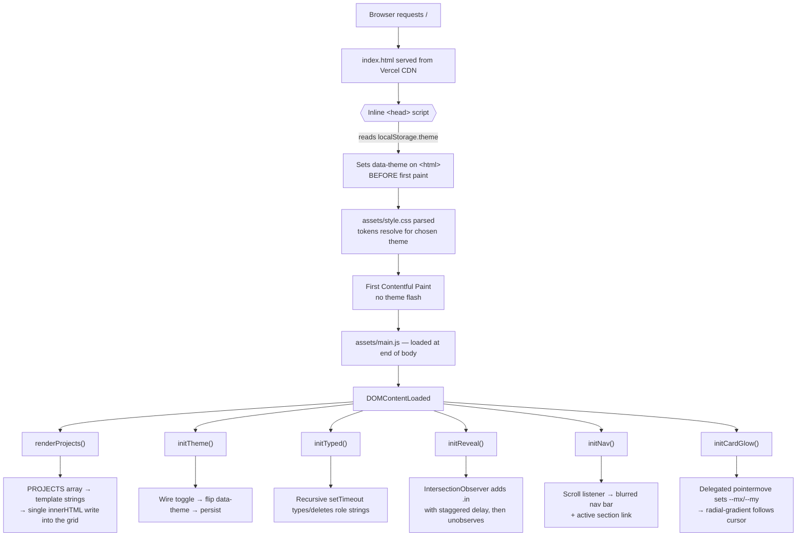
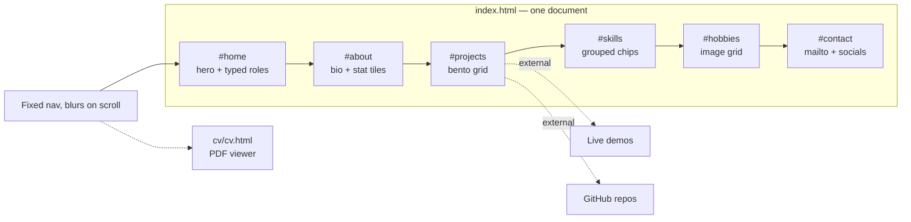
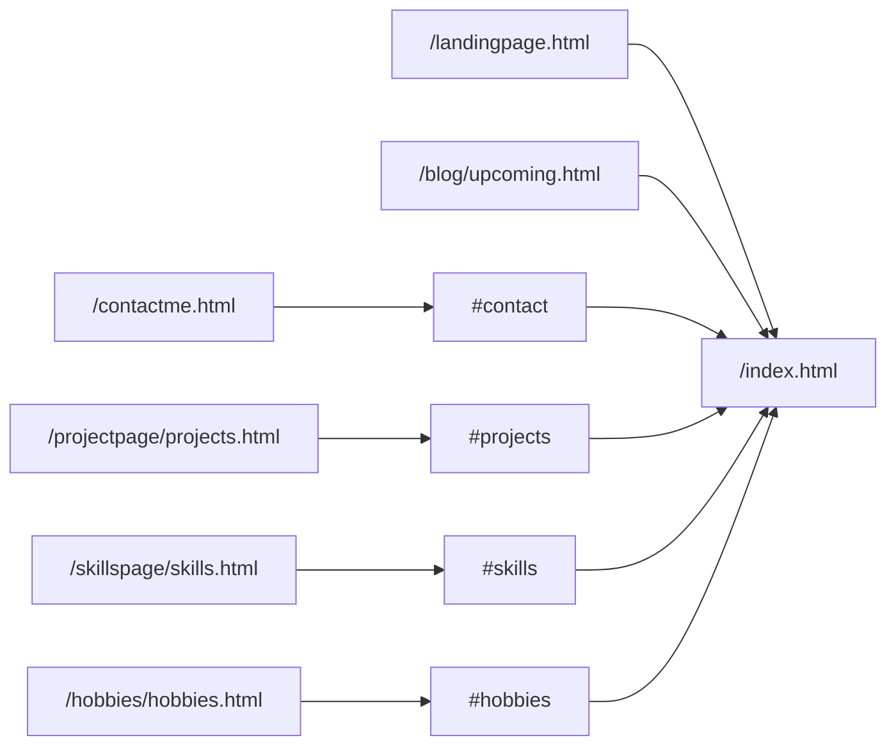
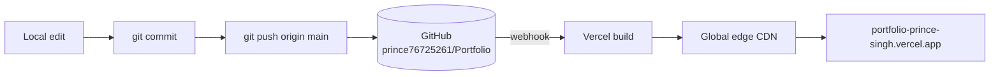

# Portfolio — Prince Kumar Singh

A single-page developer portfolio built with **vanilla HTML, CSS and JavaScript** — no framework,
no build step, no runtime dependencies. Dark/light theming, a bento-grid project showcase,
scroll-reveal animation and a data-driven project list.

**Live:** https://portfolio-prince-singh.vercel.app

---

## Table of contents

- [Tech stack](#tech-stack)
- [Architecture](#architecture)
- [Project structure](#project-structure)
- [How it works](#how-it-works)
- [Running locally](#running-locally)
- [Adding a project](#adding-a-project)
- [Deployment](#deployment)
- [Interview questions & answers](#interview-questions--answers)

---

## Tech stack

| Layer | Choice | Why |
|---|---|---|
| Markup | Semantic HTML5 | Landmarks (`header`/`main`/`section`/`footer`) give screen readers real structure |
| Styling | Vanilla CSS with custom properties | Design tokens make theming a single-attribute swap |
| Behaviour | ES6+, no dependencies | ~10 KB of JS total; nothing to audit, patch or bundle |
| Fonts | Inter + JetBrains Mono (Google Fonts) | `preconnect` + `display=swap` to avoid blocking first paint |
| Icons | Inline SVG | No icon-font request, inherits `currentColor`, themes for free |
| Hosting | Vercel (static) | Git-push deploys, global CDN, automatic HTTPS |

---

## Architecture

### Render pipeline



### Section map



### Legacy URL handling

The site used to be six separate Bootstrap pages. Those URLs still resolve — each old page is now a
redirect stub so existing links and bookmarks don't 404:



### Deployment pipeline



---

## Project structure

```
Portfolio/
├── index.html              # the entire site — every section lives here
├── assets/
│   ├── style.css           # design tokens + all component styles
│   └── main.js             # PROJECTS data + all behaviour
├── cv/
│   ├── cv.html             # themed PDF viewer
│   └── NIT JAMSHEDPUR_PRINCE KUMAR SINGH.pdf
├── hobbies/                # images used by #hobbies
├── landingpage.html        # ─┐
├── contactme.html          #  │
├── projectpage/            #  ├─ redirect stubs for the old multi-page site
├── skillspage/             #  │
└── blog/                   # ─┘
```

---

## How it works

**Theming.** Every colour is a CSS custom property on `:root`. `[data-theme="light"]` redefines the
same token names. Switching themes is one attribute write — no class churn, no re-render. A tiny
inline script in `<head>` applies the saved theme *before* the stylesheet paints, which is what
prevents the white flash you normally get with JS theming.

**Projects.** `PROJECTS` in `assets/main.js` is the single source of truth. Each entry renders to a
card; `featured: true` makes it span two columns in the bento grid. Adding a project is one object.

**Reveal animation.** `IntersectionObserver` adds `.in` when an element scrolls into view, with a
per-entry stagger, then unobserves it — the observer does no work after the first pass.

**Card highlight.** One delegated `pointermove` listener on `document` writes `--mx`/`--my` onto the
hovered card. The card's `::after` uses those in a `radial-gradient`, so the glow follows the cursor
with zero per-card listeners.

**Motion safety.** `prefers-reduced-motion` collapses every animation and shows revealed content
immediately; the typing effect degrades to static text.

---

## Running locally

No build step. Any static server works:

```bash
python3 -m http.server 8000
# then open http://localhost:8000
```

Opening `index.html` via `file://` also works, though `localStorage` and fonts behave better over HTTP.

---

## Adding a project

Append an object to `PROJECTS` in [`assets/main.js`](assets/main.js):

```js
{
  name: "Project name",
  mono: "PN",                                    // 2 letters on the card cover
  year: "2026",
  featured: false,                               // true = double-width card
  cover: "linear-gradient(135deg,#7c6cff,#23d3c4)",
  desc: "One or two sentences on what it does.",
  tags: ["React", "Node.js"],
  live: "https://…",                             // optional
  repo: GH + "/repo-name",                       // optional
  repo2: GH + "/repo-backend",                   // optional, renders as "Backend"
}
```

---

## Deployment

Pushing to `main` triggers a Vercel build automatically. To deploy manually:

```bash
vercel --prod
```

---

## Interview questions & answers

Questions an interviewer is likely to ask about this project, grouped by theme.

### Architecture & decisions

<details>
<summary><b>Why vanilla JS instead of React for a developer portfolio?</b></summary>

The portfolio is a static content site — one document, no routing, no server state, no user input
beyond a theme toggle. React would add ~45 KB gzipped of runtime plus a build pipeline to solve
problems this site doesn't have.

What React buys you is reconciliation for frequently changing state. Here the DOM is written once at
`DOMContentLoaded` and then barely mutates. The whole JS bundle is under 10 KB uncompressed and ships
with zero dependencies, which also means zero supply-chain surface and nothing to keep patched.

I use React where it earns its place — Talk-A-Tive and Cryptopedia both have genuine client state
(socket streams, cached API data, Redux slices). The point isn't that one is better; it's matching
the tool to the problem.
</details>

<details>
<summary><b>Walk me through what happens between the request and first paint.</b></summary>

1. Vercel's CDN serves `index.html` from an edge node.
2. The parser hits a blocking inline `<script>` in `<head>` that reads `localStorage.theme` (falling
   back to `prefers-color-scheme`) and sets `data-theme` on `<html>`.
3. `style.css` is fetched and parsed; because `data-theme` is already set, the custom properties
   resolve to the correct palette on the first pass.
4. First Contentful Paint — in the right theme, with no flash.
5. `main.js` sits at the end of `<body>`, so it runs after parsing. On `DOMContentLoaded` it renders
   projects, wires the toggle, starts the typing loop and registers the observers.

The ordering is the whole trick: the theme script must be blocking and must run before the stylesheet
applies, otherwise you paint the default theme first and then repaint.
</details>

<details>
<summary><b>You converted a six-page site into one page. How did you avoid breaking existing links?</b></summary>

Every old path still exists as a stub that does three things: a `<meta http-equiv="refresh">` for
no-JS clients, a `location.replace()` for instant client-side redirect, and a `<link rel="canonical">`
so search engines consolidate ranking onto the new URL. There's also a visible fallback link if both
mechanisms fail.

`location.replace()` rather than `location.href` matters — `replace` doesn't push a history entry, so
the back button returns to where the user actually came from instead of bouncing them through the
redirect again.

In production I'd prefer real 301s via `vercel.json` since they're cheaper and unambiguous for
crawlers; the HTML stubs are the version that works identically on any static host.
</details>

### CSS

<details>
<summary><b>How does the theming system work, and why custom properties over two stylesheets?</b></summary>

All colour decisions are tokens on `:root` — `--bg`, `--text`, `--accent`, `--border` and so on.
`[data-theme="light"]` redefines the *same names* with different values. Components never reference a
literal colour, only tokens, so a theme swap is one attribute write and the cascade does the rest.

Two stylesheets would mean a second network request, duplicated component rules that drift apart over
time, and a flash while the alternate sheet loads. Tokens keep one source of truth for layout and
structure, with only ~20 values differing between themes.

I also set `color-scheme` per theme so form controls, scrollbars and the browser's own UI match.
</details>

<details>
<summary><b>Explain the cursor-following glow on the cards.</b></summary>

Each card has an `::after` pseudo-element with
`radial-gradient(340px circle at var(--mx) var(--my), var(--accent-soft), transparent)`, at
`opacity: 0` until hover.

A single delegated `pointermove` listener on `document` finds the nearest `.card` via `closest()`,
computes cursor position relative to that card with `getBoundingClientRect()`, and writes `--mx`/`--my`
as inline custom properties. CSS handles the rendering.

Two things make it cheap: one listener for all cards regardless of count, and the listener is
`{ passive: true }` so it never blocks scrolling. Only custom properties feeding a paint-level
property change, so there's no layout recalculation.
</details>

<details>
<summary><b>How is the bento grid responsive?</b></summary>

The container is `grid-template-columns: repeat(6, 1fr)`. Standard cards span 2 (three per row),
featured cards span 3 (two per row). Six is chosen because it divides by both 2 and 3.

At ≤900px everything becomes `span 3` on a 3-column track — two per row, featured cards lose their
emphasis since it stops meaning anything at that width. At ≤720px it collapses to a single column.

The alternative, `auto-fit` with `minmax()`, is fewer lines but gives up control over which cards get
emphasis — and the featured/standard distinction is the point of a bento layout.
</details>

<details>
<summary><b>What did you do about accessibility?</b></summary>

- Semantic landmarks (`header`, `main`, `section`, `footer`, `nav aria-label`) so screen readers get real structure.
- Every icon-only button has an `aria-label`; the mobile menu toggle maintains `aria-expanded`.
- `:focus-visible` styling everywhere — keyboard users see focus, mouse users don't get outline noise.
- `prefers-reduced-motion` disables the mesh drift, reveal transitions and typing effect, and shows all content immediately.
- Decorative elements (the gradient mesh) are `aria-hidden="true"`.
- Body text sits at or above WCAG AA contrast in both themes; `--text-dim` is reserved for non-essential text.

What I'd add next: a skip-to-content link, and a focus trap on the mobile menu.
</details>

### JavaScript

<details>
<summary><b>Why IntersectionObserver instead of a scroll handler?</b></summary>

A scroll handler fires on every scroll event on the main thread, and each element needs
`getBoundingClientRect()` — that forces synchronous layout, so with 30 elements you get 30 forced
reflows per frame.

`IntersectionObserver` runs off the main thread and only invokes the callback when an element actually
crosses the threshold. I also `unobserve()` each element after revealing it, so the observer stops
doing any work once the user has scrolled through. There's a `!("IntersectionObserver" in window)`
fallback that just shows everything.
</details>

<details>
<summary><b>Your typing effect uses recursive setTimeout, not setInterval. Why?</b></summary>

The delay isn't constant. Typing a character is ~85ms, deleting is ~45ms, there's a 1700ms pause at
the end of a word and 350ms before the next one starts. `setInterval` gives you one fixed period.

Recursive `setTimeout` also guarantees the previous tick finished before the next is scheduled —
`setInterval` will queue callbacks up if the main thread stalls, and you get a burst of characters
after a jank.

For pure animation `requestAnimationFrame` would be the more correct primitive, but it fires at 60fps
and I'd be throttling it back down to ~12 characters per second, so timers express the intent more
directly.
</details>

<details>
<summary><b>You build cards with innerHTML and template strings. Isn't that an XSS risk?</b></summary>

It would be if any of it were user-controlled. `PROJECTS` is a hard-coded array in a static file I
author — there's no input path from a user, a URL parameter or an API. The threat model for injection
requires attacker-controlled data reaching the sink, and there isn't one here.

If this were fed by a CMS or an API I'd change the approach: build nodes with `createElement` and set
text via `textContent`, which can't execute markup, and only use `innerHTML` for content I've
sanitised. I also concatenate the full grid into one string and do a *single* `innerHTML` write rather
than one per card — nine writes would mean nine parse-and-layout cycles.
</details>

<details>
<summary><b>Where else did you use event delegation, and what does it buy you?</b></summary>

Two places. The card glow uses one `pointermove` on `document` instead of one per card — with nine
cards rendered dynamically, per-card listeners would need re-attaching after every render. The mobile
menu uses one click listener on the container that checks `e.target.tagName === "A"` to close the menu
on navigation.

The wins are constant memory regardless of element count, and correctness with dynamically inserted
DOM — delegated handlers work on elements that didn't exist when the listener was attached.
</details>

<details>
<summary><b>Why wrap localStorage in try/catch?</b></summary>

`localStorage` throws rather than returning null in several real situations: Safari private browsing
historically threw `QuotaExceededError` on write, browsers configured to block site data throw on
access, and reading it from a sandboxed iframe throws a `SecurityError`.

An uncaught throw in the head script would abort it and leave `data-theme` unset. So both the read and
the write are guarded, and the fallback is `prefers-color-scheme` — the feature degrades to "follows
your OS" instead of taking the page down.
</details>

### Performance & SEO

<details>
<summary><b>How would you improve the Lighthouse score?</b></summary>

Current strengths: no framework, no render-blocking JS, `loading="lazy"` on below-fold images, an SVG
data-URI favicon that costs no request.

What I'd fix:
- The hobby JPEGs are unoptimised. Convert to WebP/AVIF with `<picture>` fallbacks and serve responsive `srcset` — the single biggest win.
- Add `width`/`height` to those images to reserve space and kill layout shift (CLS).
- Self-host the two fonts as subset WOFF2 to drop a third-party connection and the FOUT.
- Inline the critical above-fold CSS and defer the rest.
- The `filter: blur(90px)` on the gradient mesh is expensive on low-end GPUs — a pre-rendered blurred image would be cheaper.
</details>

<details>
<summary><b>Rendering projects client-side means an empty grid in the HTML. Doesn't that hurt SEO?</b></summary>

It's a real trade-off and I made it deliberately. Googlebot renders JavaScript, so the cards do get
indexed — but rendering is queued as a second pass, so it's slower than server-rendered HTML, and
crawlers that don't execute JS see nothing.

I mitigated it with a `<noscript>` block pointing at my GitHub profile, and the parts that matter most
for search — title, meta description, Open Graph tags, the `h1`, bio and every section heading — are
all static HTML. Only the card bodies are dynamic.

If ranking on project names mattered, the fix is trivial without adding a framework: generate the
cards from `PROJECTS` at build time with a small Node script and commit the output. Same data source,
static HTML, best of both.
</details>

<details>
<summary><b>What does `rel="noopener noreferrer"` do on your external links?</b></summary>

`noopener` prevents the opened page from accessing `window.opener`, which otherwise lets a malicious
destination redirect the original tab via `window.opener.location` — the "tabnabbing" attack. It also
tends to give the new page its own process.

`noreferrer` additionally strips the `Referer` header so the destination doesn't learn where the click
came from.

Modern browsers imply `noopener` for `target="_blank"`, but I set it explicitly for older browsers and
because being explicit documents the intent.
</details>

### The featured projects

<details>
<summary><b>Talk-A-Tive — how does real-time messaging actually work?</b></summary>

The transport is Socket.IO over WebSockets, with long-polling as an automatic fallback.

On connect the client emits a `setup` event with the authenticated user, and the server joins that
socket to a room keyed by user ID. Opening a conversation joins the chat room too. When someone sends
a message, it's persisted to MongoDB first, then the server emits it to every member of that chat
room *except* the sender — the sender already rendered it optimistically.

Typing indicators are emitted straight through without persistence since they're ephemeral. Rooms are
what make this scale: you emit to a room rather than broadcasting to all connected sockets and
filtering client-side.
</details>

<details>
<summary><b>Why WebSockets rather than polling for that?</b></summary>

Polling means a full HTTP request-and-response cycle on a fixed interval regardless of whether
anything changed — mostly wasted requests, plus latency of up to one interval on every message.

WebSockets upgrade a single HTTP connection to a persistent full-duplex channel. The server pushes the
moment a message lands, so latency is one network hop, and there's no per-message header overhead.

Polling is still the right answer when updates are rare or you need plain HTTP infrastructure.
Server-Sent Events are the middle ground — simpler than WebSockets and auto-reconnecting, but
unidirectional, which doesn't work here because typing indicators flow both ways.
</details>

<details>
<summary><b>How is authentication handled in the MERN projects?</b></summary>

Registration hashes the password with bcrypt — salted, and deliberately slow so brute-forcing is
expensive. Login compares against the hash and, on success, signs a JWT containing the user ID.

The client sends that token as an `Authorization: Bearer` header; middleware verifies the signature on
protected routes and attaches the user to the request. The socket connection authenticates the same
way on `setup`.

Honest assessment: I store the token client-side, which is vulnerable to XSS. The stronger design is
an httpOnly, Secure, SameSite cookie — unreachable from JavaScript — paired with short-lived access
tokens and a refresh-token rotation, so a leaked token expires quickly.
</details>

<details>
<summary><b>Cryptopedia uses Redux Toolkit. When is Redux actually justified?</b></summary>

Redux earns its place when state is genuinely shared across distant parts of the tree and changes
often — in Cryptopedia, market data feeds the list, the detail charts and the search filter at once.
RTK Query also handles caching and request deduplication, so several components can ask for the same
endpoint and only one request goes out.

It's not justified for state one component owns, or for a theme toggle — that's `useState` or Context.
Redux Toolkit specifically removes most of the boilerplate that made classic Redux painful: `createSlice`
generates action creators and types, and Immer lets you write apparently-mutating logic that produces
immutable updates.
</details>

### Follow-ups worth preparing

<details>
<summary><b>What would you do differently, and what's next?</b></summary>

Differently: I'd generate the project cards at build time rather than at runtime — same authoring
experience, better crawlability. And I'd have converted the images to WebP before shipping.

Next up:
- Real 301 redirects via `vercel.json` instead of HTML stubs.
- A working contact form (Vercel serverless function + Resend) instead of a `mailto:` link.
- Per-project case study pages — the problem, the approach, what broke, what I'd change.
- Playwright visual regression tests, since a CSS token change can silently break one theme.
- Automated Lighthouse CI on pull requests to stop performance regressions.
</details>

---

© Prince Kumar Singh
